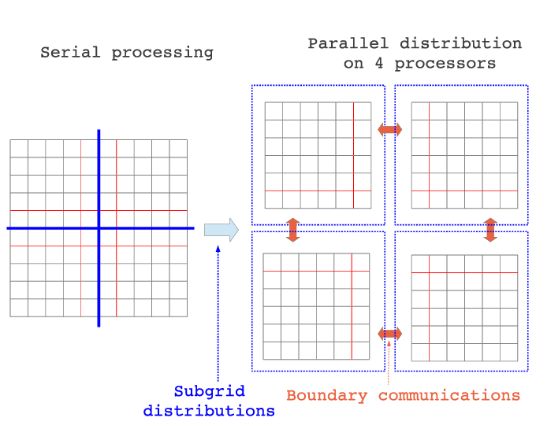
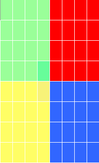
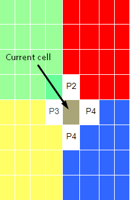
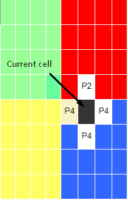
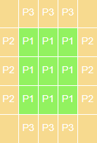

Before the Summer of HPC started, my mentor contacted us and gave us an exercise to familiarize ourselves with the MPI library and parallel programming. The exercise required us to use the domain decomposition method and at that time, I had no idea what it is. I searched the Web to learn more about it and eventually solved the exercise but it was difficult topic to learn, especially for beginners who have not experienced parallel programming before. Therefore, in this blog post, I will try to explain the domain decomposition method briefly and at the end of the post, I will leave a link to a GitHub repository that contains the exercise description and its solution. Keep in mind that I am not aiming to tell you everything about the domain decomposition but rather scratch the surface. Before further ado, let’s get started.

## Why do we need domain decomposition?

The idea behind parallel programming is to split the amount of work into available processes. But we need to be careful when splitting the work among processes because we do not want to assign uneven work. For instance, assume there are 10 processes and there are 100 units of work that need to be done. Ideally, the work should be split so that each process is responsible for 10 units of work. If there was a mistake when dividing the work and some processes got 15 units and the rest got 5 units of work, the processes that got 5 units of work would finish their work early and have to wait for the other processes and that causes a performance problem. So, we have to avoid this situation altogether. That is why **decomposing the domain** into processes is an important task.

<!-- |  | 
|:--:| 
| *The image is taken from [ResearchGate](https://www.researchgate.net/figure/Domain-decomposition_fig3_261158925)* | -->

<figure>
  
  <figcaption>The image is taken from <a href="https://www.researchgate.net/figure/Domain-decomposition_fig3_261158925">ResearchGate</a></figcaption>
</figure>

## How does it work?

By definition, domain decomposition, in the context of parallel computing, refers to the partitioning of computational work among multiple processors by distributing the computational domain of a problem, in other words, data associated with the problem. Let’s go over an example to illustrate a simple decomposition. For the sake of simplicity, I chose the data as a matrix. Below you can see an 8×8 matrix:

This will be our computational domain and we would like to get the result of a formula for each of its cells (a formula can be as simple as f(x) = (2x + 5)^3). As you can see from Figure 1, we have divided our domain into squares. You may ask this point “Why did we divide the domain into 4 squares and not like 10 squares?” Well, it is because we will use 4 processes to solve this domain and each process will be responsible for a 4×4 matrix. If the domain was big enough and we had enough computation resources, we would divide it into more than 4 squares of different sizes.

So far so good. Now, each process can substitute its cell value into the formula and get the result. That is it! But, wait. This scenario was quite naive because there was no communication involved and it is assumed that each process can access the data required by the equation. Unfortunately, most of the time there is an involvement of communication and that makes the domain decomposition a little bit harder.

Let’s continue the above example. However, this time let each process get the average of its current cell’s north, south, east and west neighbors and write the result on its current cell: 

Figure 2 illustrates what we are trying to do. The cell that is pointed by an arrow is the cell that we want to do our calculations on and the cells that have a white background are its neighbors. So, process 4 has to communicate with processes 2 and 3 to do the calculation. Assuming the communication is done and the new value is calculated and written. Now, moving on to the next cell, process 4 needs to communicate with process 2 to do the calculation:

Assuming the communication and calculation is done. In the next cell, we again need to communicate with process 2 and that will continue for all the cells. As you might notice, our program starts to lack performance as the number of communication increases. We do not want it because the reason we are programming in parallel is to improve the performance of our programs. If we communicate with other processes for each cell, the program’s efficiency would be horrible, probably worse than serial processing. So, what are we going to do? We are not trying to eliminate the communication, that is impossible. We need to know the data that other processes hold. Ideally, we would like to get all the relevant data before the calculation starts. We can store the relevant data in **guard cells** or other words, **halo cells** or **ghost cells**. Guard cells are a local copy of the physical cells from neighbor nodes and make these values readily available. To continue with the above example, if we were to take process 1’s local data, this is how it would look like:

Green cells are the actual data of process 1 and beige cells are guard cells which will be filled with processes 2’s and 3’s data after the communication. Note that the corners are empty. It is because we do not need to know these values. Only the data that is required by the communication is exchanged between the processes. Now, all processes have the required information locally. After the calculation is done, they can write the results to a file or send them to the master processes. And, this is the domain decomposition method in a nutshell.

## Note

You may notice that the data was too perfect so that it decomposed without a problem. In the real world, it is likely that you may see uneven data, like a 101×103 matrix. So, in that case, we cannot decompose it evenly. For these cases, we need to consider different approaches that I cannot cover here. Also, you do not have to decompose the matrix into squares. It can be other geometrical shapes like rectangles and even triangles.

## Conclusion

There are a bunch of things that can be learned about domain decomposition. I tried to explain it briefly but I highly recommend you to learn more about it if you find it interesting. You can check out the [GitHub repository](https://github.com/dogukanteber/domain-decomposition) if you would like to practice and experience the domain decomposition method first-hand. Although knowing only domain decomposition is not enough to solve the exercise, I left the required topics to solve the exercise. I hope you learn something from this post. If you have any questions, please leave a comment below.

Thank you for reading.