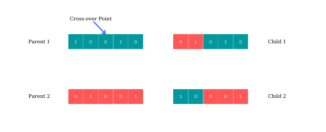
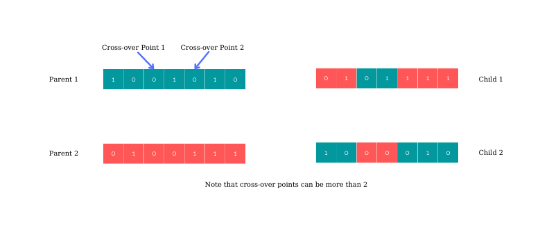
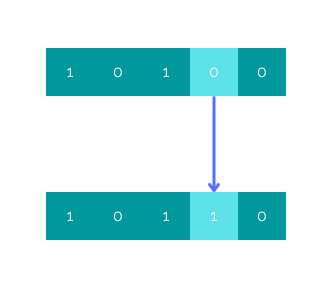
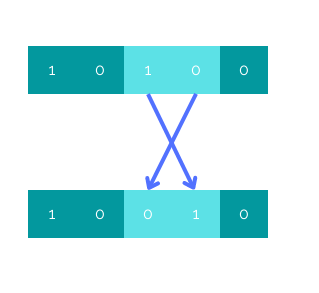
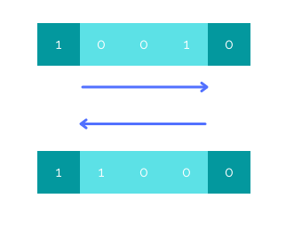
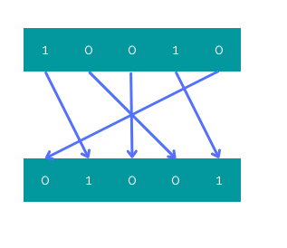

# What is the Genetic Algorithm?

The genetic algorithm is a search heuristic that is used to find optimal or near-optimal solutions to problems that can be represented as a set of discrete values. This heuristic is often used in optimization and machine learning problems. The genetic algorithm works by creating a population of potential solutions and then iteratively improving the population by applying a set of operators, such as selection, crossover, and mutation. It is a type of optimization algorithm that is inspired by the process of natural selection. The algorithm mimics the process of natural selection in order to find the best solution to a problem.

<figure>
  
  <figcaption><a href="https://www.toptal.com/algorithms/genetic-algorithms">Image source</a></figcaption>
</figure>

# How does the Genetic Algorithm work?

The algorithm starts with a population of potential solutions (called chromosomes). Each solution has a fitness value that represents how well that solution solves the problem. The algorithm then selects the best solutions (called parents) and produces new solutions (called offspring) by combining the parents' chromosomes. This is often done by randomly selecting a point in each parent's chromosome and combining the parts before that point with the parts after that point to form the offspring. If a new offspring's fitness is better than its parents', the offspring replaces its parents. Over time, the population should consist mostly of good solutions and the average fitness of the population should increase.

# What is a chromosome?

A chromosome is a set of values that represents a potential solution. The representation can be different depending on the problem. There are a few ways to represent a chromosome in the genetic algorithm. A representation can be one of these forms, but not limited to these:

- binary where each bit represents a gene
- array of integers where each integer represents a gene
- string where each character represents a gene

One can design many other ways to represent a solution using various data structures and data types. However, one might be careful not to choose a representation that is computationally expensive. The reason to that is mutation and crossover operations are done on these chromosomes many times. So, one should avoid using complex representations if there is already a simple way to represent a solution. Doing so will also make the implementation of crossover and mutation operators easy.

# Operators of the Genetic Algorithm

Above we mentioned the operators of the genetic algorithm. Let's talk about each one of them individually. As it is mentioned, the genetic algorithm has several operators that are used to manipulate the population of chromosomes. These operators include selection, crossover, and mutation.

## Selection

Selection is used to choose which chromosomes will be used to create the next generation. Selection is usually done using a **fitness function** that evaluates the fitness of each chromosome. The fitness function is used to determine how well a chromosome performs a given task. The higher the fitness, the more likely the chromosome is to be selected. There are three main types of selection processes in the genetic algorithm: selection by fitness, selection by tournament and selection by roulette wheel.

**Selection by fitness:** This is the most common type of selection process, in which individuals are selected for reproduction based on their fitness levels. The more fit an individual is, the higher their chances of being selected.

**Selection by tournament:** In this type of selection process, a number of individuals are selected at random and then compete against each other in a tournament. The winner of the tournament is then selected for reproduction.

**Selection by roulette wheel:** Individuals are selected for reproduction based on their fitness levels, but the selection process is probabilistic in nature. The more fit an individual is, the higher their chances of being selected.

## Crossover

Crossover is used to create new chromosomes from existing chromosomes. Crossover operator takes two parent chromosomes and creates a new chromosome by combining parts of each parent. Crossover typically occurs at random points in the chromosome. There are two types of crossovers in the genetic algorithm: single-point crossover and multi-point crossover.

**Single-point crossover:** A single point is chosen in the genome of each parent, and the alleles to the left and right of that point are swapped between the two parents to create two new offspring. For example, if parent A has the genome "10010" and parent B has the genome "01001", and the crossover point is chosen as the third position from the left, then the two offspring will have the genomes "01010" and "10001".

**Multi-point crossover:** Multiple points are chosen in the genome of each parent, and the alleles between those points are swapped between the two parents to create two new offspring. For example, if parent A has the genome "1001010" and parent B has the genome "0100111", and the crossover points are chosen as the first and third positions from the left, then the two offspring will have the genomes "0101111" and "1000010".

## Mutation

Mutation is used to create new, random chromosomes. Mutations can occur at any point in the chromosome and can change any aspect of the chromosome. There are several types of mutation processes that can be used in a genetic algorithm, including:

**Point mutation:** This is the most common type of mutation, and simply involves randomly changing one or more genes in a chromosome.

**Swap mutation:** We select two positions on the chromosome at random, and interchange the values. This is common in permutation based encodings.

**Inversion mutation:** This type of mutation involves reversing the order of genes in a chromosome.

**Scramble mutation:** This type of mutation involves randomly shuffling the order of genes in a chromosome.

# The Algorithm

Here is the pseudo-code for the genetic algoritm:

1. Initialize the population
2. Evaluate the fitness of each individual in the population
3. Select the best individuals from the population for reproduction
4. Perform crossover and mutation operations on the selected individuals to generate new offspring
5. Evaluate the fitness of the new offspring
6. Replace the worst individuals in the population with the new offspring
7. Repeat steps 2-6 until a stopping criterion is met

Note that stopping criterion depends on the problem. One may run the algorithm X times while others can expect to get a solution that reaches to a specific fitness value.

# Pros and Cons of the GA

| Pros                                                                                                  | Cons                                                                                                                            |
| ----------------------------------------------------------------------------------------------------- | ------------------------------------------------------------------------------------------------------------------------------- |
| It can be used to solve problems that are difficult or impossible to solve using traditional methods. | It is a stochastic method and may not find the optimal solution to a problem.                                                   |
| It is a versatile tool that can be applied to a wide variety of problems.                             | It can be slow, especially when searching for the global optimum of a large problem.                                            |
| It is capable of finding solutions that are close to the global optimum.                              | It requires a good understanding of the problem in order to set up the parameters properly and interpret the results correctly. |
| It is relatively easy to implement and does not require sophisticated programming skills.             |                                                                                                                                 |
| It can be parallelized and run on multiprocessor systems, which can speed up the search process.      |                                                                                                                                 |

# Challenges associated with using the GA?

Some of the challenges associated with using the genetic algorithm are:

- **The size of the population:** The genetic algorithm works best with a large population size. This can be a challenge when working with real-world data sets, which can be very large.

- **The number of generations:** The genetic algorithm can take a long time to converge on a solution, especially if the number of generations is large.

- **The fitness function:** The fitness function must be carefully designed to ensure that the genetic algorithm is able to find a good solution.

- **The potential for converging on a local optimum:** If the objective function is not convex, then there may be multiple local optima and it can be difficult to identify which one is the global optimum. Even if the objective function is convex, the problem may be non-smooth (e.g., have discontinuities) which can make it difficult for gradient-based optimization methods to converge to the global optimum. Additionally, if the problem is large-scale (e.g., many variables and/or constraints), then it may be computationally infeasible to find the global optimum and one must settle for a good local optimum instead.

# Conclusion

The genetic algorithm is a search heuristic that is used to find optimal or near-optimal solutions to problems that can be represented as a set of discrete values. This heuristic is often used in optimization and machine learning problems. The genetic algorithm works by creating a population of potential solutions and then iteratively improving the population by applying a set of operators, such as selection, crossover, and mutation.

In the next post, we will solve the traveling salesman problem (TSP) using the genetic algorithm in Java programming language.

Thank you for reading.
