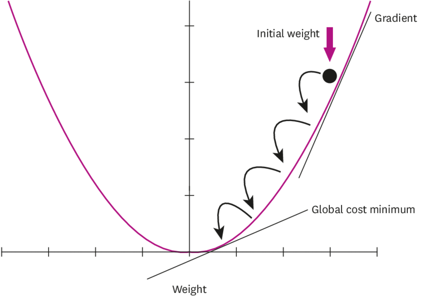

Linear regression is one of the basic and powerful algorithms in machine learning. In this post, I will try to explain how to implement linear regression using a gradient descent algorithm.

Before jumping right into the code, let me briefly talk about what linear regression is. Linear regression is one of the supervised learning algorithms. It performs a regression task and models a target prediction value based on independent variables. The independent variables are also called features. However, for now, we will only focus on one variable. Hence, the name univariate linear regression.
In the end, we want a linear function that fits optimally for the given data set. We can represent this function as:

$$h_\theta(x) = \theta_0 + \theta_1x$$

where $\theta_0$ and $\theta_1$ are the parameters. We will use the gradient descent algorithm to optimize parameters $\theta_0$ and $\theta_1$ but before that, we need to find a way to know how good our current guess is. This is where the cost function comes into play.

### Cost Function

The cost function, also known as the lost function, determines how well a machine learning model performs for a given dataset. It calculates the difference between the actual value and the predicted value and represents it as a single real number. To get this information, we basically calculate the distance between the training data and the linear function line.


Many cost functions are depending on the problem. The one we will be using is mean square error (MSE). It is one of the most commonly used cost function methods. We can calculate the loss by using this formula:

$$
J(\theta_0, \theta_1) = \frac{1}{m}\sum_{i=1}^{m} (h_\theta(x^{(i)})- y^{(i)})^2
$$

What we are doing here is getting the difference between the actual and the predicted value, taking the power of the result, and performing a summation for all the samples. Then we divide the summation result by the number of samples.

### Gradient Descent Algorithm

A cost function on its own is not very useful since we do not change the predicted value. At each step, we want to get better parameters and calculate the cost for these parameters. The optimal parameters should give us the minimum cost. To find the optimal parameters, we use the gradient descent algorithm.

<div>
    
</div>


In the above graph, the y-axis represents costs and the x-axis represents a parameter's value. Since we will run the gradient descent algorithm for each parameter, the x-axis will change for each parameter. This is how the algorithm works:

* Start from an arbitrary position
* Take the derivative of the cost function for the parameter
* Multiply the learning rate with the derivation result
* Update the parameter by subtracting the above multiplication result from the parameter's previous value

For this problem, we only have two parameters which are $\theta_0$ and $\theta_1$. So, here are the derivation results for both parameters:

$$
    \frac{dJ}{d\theta_0} = \frac{-2}{m}\sum_{i=1}^m(h_\theta(x^{(i)}) - y^{(i)})
$$

$$
    \frac{dJ}{d\theta_1} = \frac{-2}{m}\sum_{i=1}^m(h_\theta(x^{(i)}) - y^{(i)}) \cdot x^{(i)}
$$


As the image illustrates, our goal is to minimize the cost. We can do that by taking the derivate of each point and calculating the cost again and again until we reach an optimal point. There are three ways that we can understand we reach a local minimum when:

* the cost is 0 (which is not realistic in the real world)
* we come to the end of total epochs or iterations
* there is not much difference between the previous cost and the current cost

Enough theory, let's implement our very first linear regression algorithm. You can download the dataset for this post from [here](static/data.csv).

To start, import the following libraries:


```python
import numpy as np
import pandas as pd
%matplotlib inline
import matplotlib.pyplot as plt
```

Let's read the data and see how it looks like.


```python
data = pd.read_csv("data.csv")
X = data.iloc[:, 0]
Y = data.iloc[:, 1]

plt.scatter(X, Y)
plt.show()
```


    

    


Let's implement the gradient descent algorithm.


```python
def cost_function(y_actual, y_prediction):
    return np.sum( (y_actual - y_prediction) ** 2) / len(y_actual)


def gradient_descent_threshold(X, Y, epochs=500, learning_rate=0.0001, stopping_threshold=1e-4):
    m = float(len(X))
    theta_0, theta_1 = 0.01, 0.1
    cost_history = list()
    theta_0_history = list()
    theta_1_history = list()
    prev_cost = None
    for i in range(epochs):
        y_pred = theta_0 + theta_1 * X
        
        curr_cost = cost_function(Y, y_pred)
        if prev_cost and abs(prev_cost - curr_cost) <= stopping_threshold:
            break

        prev_cost = curr_cost
        
        cost_history.append(curr_cost)
        theta_0_history.append(theta_0)
        theta_1_history.append(theta_1)

        derivative_theta_0 = (-2/m) * np.sum(Y - y_pred)
        derivative_theta_1 = (-2/m) * np.sum(X * (Y - y_pred))

        theta_0 = theta_0 - (learning_rate * derivative_theta_0)
        theta_1 = theta_1 - (learning_rate * derivative_theta_1)

    return theta_0, theta_1, cost_history, theta_0_history, theta_1_history


theta_0, theta_1, costs, theta_0_hist, theta_1_hist = gradient_descent_threshold(X, Y)
y_pred = theta_0 + theta_1 * X

plt.scatter(X, Y)
plt.plot([min(X), max(X)], [min(y_pred), max(y_pred)], color='red')
plt.show()
```


    

    


And, voila. We have fit our linear regression model. Let's the how costs changed overtime for each variable.


```python
f, (ax1, ax2) = plt.subplots(1, 2, sharey=True, figsize=(18, 5))
ax1.plot(theta_0_hist, costs)
ax1.set_xlabel('theta_0')
ax1.set_ylabel('cost')

ax2.set_xlabel('theta_1')
ax2.set_ylabel('cost')
ax2.plot(theta_1_hist, costs)

plt.show()
```


    

    


This is it. I hope you get something out of this blog post. In the next post, we will implement this algorithm with multiple variables.

Thank you for reading.
